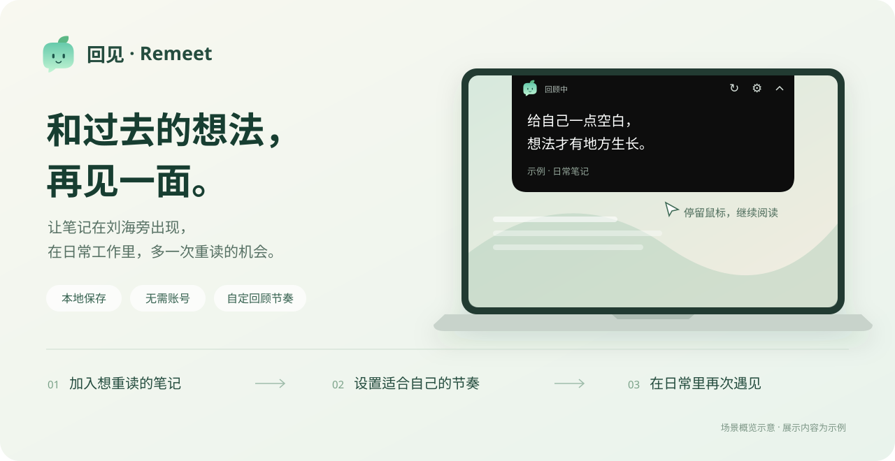
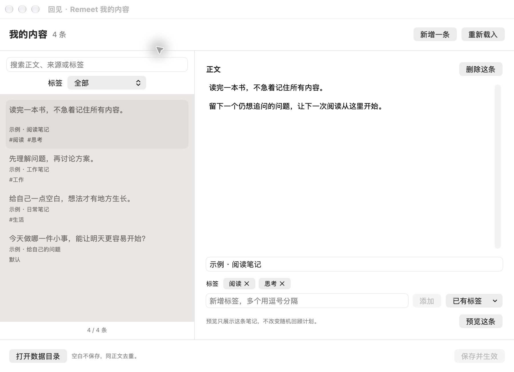
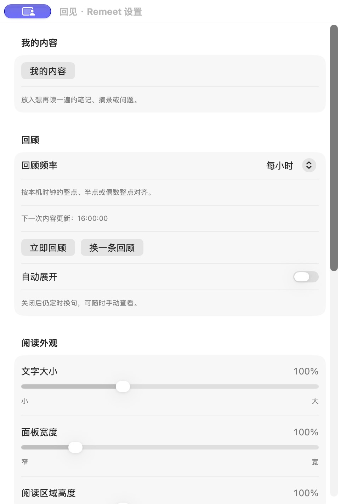

# 回见 · Remeet

[](https://github.com/catwithtudou/remeet/actions/workflows/ci.yml)

**和过去的想法，再见一面。**

回见是一款 Mac 每日回顾工具。让读书摘录、工作想法和留给自己的问题，在刘海旁再次出现，把记过的笔记重新带回日常。

本地保存 · 无需账号 · 自定义回顾节奏

**[产品官网](https://catwithtudou.github.io/remeet/)** · [使用指南](https://catwithtudou.github.io/remeet/guide.html)



## 安装

**[下载回见 App](https://github.com/catwithtudou/remeet/releases)** · Apple Silicon（M 系列芯片）· macOS 14 或更新版本

1. 在 [Releases](https://github.com/catwithtudou/remeet/releases) 的 **Assets** 中下载以 `Remeet-` 开头的 App ZIP 附件。不要下载 **Source code**，那是源码。
2. 解压，将 **Remeet.app** 拖入「应用程序」，然后打开。
3. 点击菜单栏的小芽图标开始使用；回见不会常驻 Dock。

> 当前版本尚未使用 Apple Developer ID 签名，也未经过 Apple 公证。首次打开可能被 macOS 拦截，需要手动允许。

若提示无法验证开发者，或 Apple 无法检查是否包含恶意软件：

1. 先尝试打开一次 App。
2. 前往 **系统设置 → 隐私与安全性**，找到回见对应的提示，点击 **仍要打开**。
3. 再次确认打开，按提示输入登录密码。允许后，通常可以直接打开此版本。

仅在确认下载来源和文件可信后操作。系统版本不同，提示文字可能略有差异；受公司管理的 Mac 可能不提供该选项。详见 [Apple 官方说明](https://support.apple.com/zh-cn/102445)。

## 开始第一次回顾

1. 菜单栏小芽图标 → **我的内容**，添加一段笔记，可选填来源和标签。
2. 点击 **保存并生效**，或按 `⌘S`。
3. 点击 **预览这条**，看看刚保存的笔记。

启动时自带几条示例，可直接编辑或删除。回见默认每小时随机展示一条；想马上阅读，从菜单选择 **立即回顾**，或用 **换一条回顾**切换内容。


## 整理想再次遇见的内容

搜索正文、来源或标签，按主题找回笔记。一条笔记可以有多个标签，没有标签的内容归入「默认」。切换条目时会保留未保存的草稿。



输入标签后回车或点击「添加」，也可以选择已有标签。标签筛选只影响这个列表，日常回顾仍从全部内容中随机选择。

0.2.15 起支持内容恢复：误删后可点击「撤销删除」，连续删除可以逐条撤销；保存、重新载入或放弃草稿后清空撤销记录。修改已有内容并保存时，App 自动保留最近 10 份保存前备份。在「我的内容 → 恢复备份」选择一份载入为草稿，检查后点击「保存并生效」。载入备份前如有未保存修改，会先提示确认；恢复保存也会备份当前文件。

0.2.15 也支持「导出草稿」：保存遇到外部修改冲突时，先将全部草稿另存为 JSON，再重新载入最新内容。导出成功后点击「查看文件」定位副本，按需对照继续编辑。导出不会使草稿生效，也不会自动合并或覆盖已有内容。

0.2.15 保存时若存在重复或空白正文，会先列出不会保存的条目及其来源、标签。可以「返回编辑」或「确认忽略并保存」；关闭窗口、退出时选择保存也会检查。同正文仍只保留列表中的第一条，来源和标签不会自动合并。

## 按自己的节奏阅读

鼠标停留在卡片上，可以继续阅读；移开后自动收起。需要专注时，从菜单暂停展示。

| 想做什么 | 在哪里调整 |
| --- | --- |
| 改变回顾频率 | 设置 → 回顾频率，选择常用间隔或自定义分钟／小时 |
| 延长展示时间 | 设置 → 阅读时长，选择常用值或自定义秒数 |
| 调整文字和卡片大小 | 设置 → 阅读外观 |
| 只在自己想看时出现 | 关闭「自动展开」，通过菜单或悬停查看 |
| 暂停一段时间 | 菜单 → 暂停展示；需要时恢复 |

<details>
<summary>查看设置界面</summary>



</details>

以上界面使用示例笔记，截图为 0.2.14；0.2.15 新增内容恢复与保存提示，0.2.16 新增登录时启动设置。顶部概览为场景示意。

## 导入已有笔记

源码开发版已提供「我的内容 → 导入 JSON」：先查看新增、重复和空白条目，确认后自动备份并合并。该功能尚未发布，公开 0.2.16 不包含此入口；格式、草稿保护及预览图见 [App 内 JSON 导入](docs/CONTENT_IMPORT.md#app-内-json-导入源码开发版)。

可选的 **回见助手 Skill（`remeet`）** 可以帮助整理文本、Markdown 和 flomo 导出，再加入回见。普通使用不需要安装 Skill。

在终端运行，按提示选择使用的 Agent：

```sh
npx skills add catwithtudou/remeet --skill remeet -g
```

安装命令需要 Node.js 22.20+，内容导入需要 Python 3.10+。安装后在 Agent 中调用：

> 使用 $remeet，把这些笔记加入回见，保留原文和来源，跳过重复内容。

这是一次性导入，目前只导入文字，不连接笔记账号或自动同步。安装方式与详细操作见 [笔记导入指南](docs/CONTENT_IMPORT.md)。

## 常见问题

**必须有刘海屏吗？** 不需要。无刘海屏会在屏幕顶部居中显示。

**内容保存在哪里？** 保存在本机。菜单中选择「打开数据目录」即可查看和备份。App 无需账号，也不依赖联网运行。

**升级会丢笔记吗？** 保存草稿并退出回见，再替换「应用程序」中的 App。已保存笔记和设置继续保留；目前没有自动更新。

**为什么刚打开没出现卡片？** 启动时默认收起，可以点击「立即回顾」。未开启「登录时启动」时，Mac 重启后需要重新打开回见；若上次暂停了展示，还需要恢复。

**可以登录时自动启动吗？** 0.2.16 起支持「设置 → 启动 → 登录时启动」。不会默认开启；如显示需要系统允许，点击「打开系统登录项设置」处理。开关以系统实际状态为准，登录启动仍保留上次的暂停状态。

**时间是怎么算的？** 常用间隔按本机整点或半点对齐；自定义间隔从点击「应用」时起算，重启后重新计时。手动查看不会改变下一次计划，睡眠后不会补播。

## 开发与贡献

构建与测试见 [开发说明](docs/DEVELOPMENT.md)，提交改动前请阅读 [贡献指南](CONTRIBUTING.md)。

遇到问题可提交 [Issue](https://github.com/catwithtudou/remeet/issues)，附上 App 版本、macOS 版本和复现步骤；截图请使用示例内容。

灵感来自 flomo 的[每日回顾](https://help.flomoapp.com/advance/lucky.html)：让记录多一次被看见。回见是独立项目。

本项目采用 [MIT 许可证](LICENSE)。
