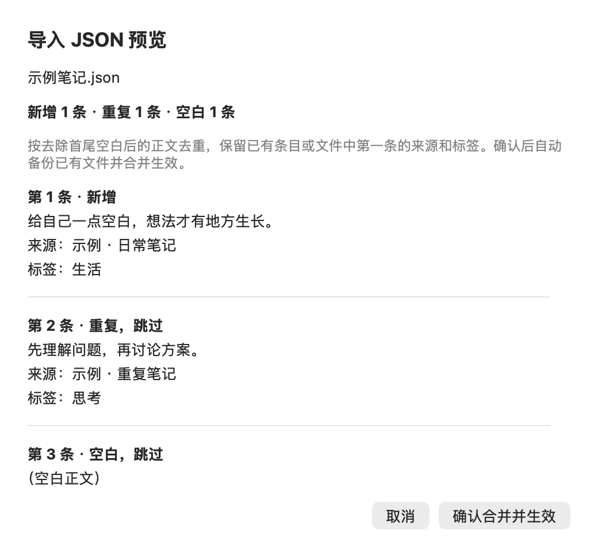
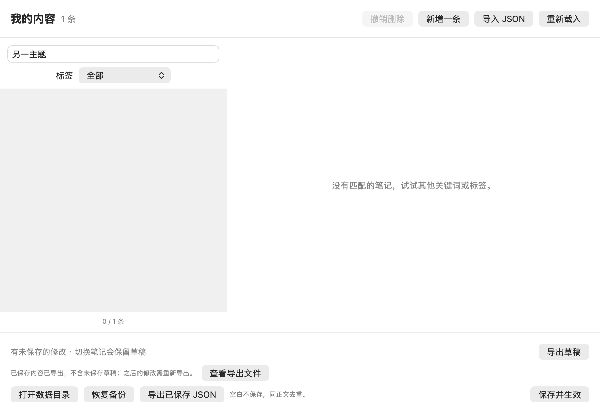

# 内容导入、导出与批量管理

0.2.17 起，兼容的内容 JSON 可在 App 内预览导入，并将已保存内容导出为 JSON。其他格式可由随仓库提供的 `remeet` Skill 转换。App 不联网、不调用模型；Skill 可以按请求筛选或整理内容，最终交给确定性脚本执行文件变更。只有原文转换时默认不改变含义；要求摘要/改写时应预览原文与结果的对应关系。

## App 内 JSON 导入

1. 打开「我的内容 → 导入 JSON」，选择 UTF-8 JSON 文件。格式为 `[{"text":"笔记正文","source":"可选来源","tags":["可选标签"]}]`。
2. 检查新增、重复、空白数量及逐条正文、来源和标签。正文去首尾空白后去重；同正文保留已有条目，文件内重复只保留第一条，不追加或覆盖来源与标签。
3. 点击「确认合并并生效」。修改已有文件前会备份原文件；取消预览不会修改内容。空数组、全重复或全空白不会写文件或创建备份。

有未保存修改时，先保存；若遇到外部修改冲突，可先「导出草稿」，再重新载入、对照处理后导入。预览后源文件、目标文件或草稿变化时拒绝合并，请取消并重新预览。读取、格式、备份或写入失败均不会替换编辑草稿和内存内容池；失败的确认会保留预览。

`text` 必须是字符串，可选 `source` 和 `tags` 分别为字符串和字符串数组，不接受 null；任何条目格式错误都会拒绝整个文件。App 沿用原有规则忽略未知字段；Skill helper 会报错。App 备份保存在数据目录 `editor-backups/`，最近 10 份可通过「恢复备份」载入为草稿。



图片为 0.2.17 原生视图的离屏渲染，不代表真实文件选择或按钮点击已验收。

## 导出已保存 JSON

「我的内容 → 导出已保存 JSON」通过系统保存面板选择文件位置。导出磁盘上已保存的全部内容，不受搜索和标签筛选影响；未保存的修改仍留在草稿中。如需带走这些修改，先保存，或使用独立的「导出草稿」。此入口从 0.2.17 起提供。

导出保留内容文件原始字节，包括正文、来源、标签和未知字段，不重新整理内容。文件须符合 App 的内容 JSON 格式；缺失、不可读或格式错误时拒绝导出，不以空数组替代。已保存的合法空数组可以导出。

选择已有导出文件时由系统确认替换；不能导出到正在使用的内容文件（含指向它的链接）。取消或失败不改变草稿、已保存内容、回顾计划和保存冲突状态；导出也不会更新编辑器的文件基线。成功后可点击「查看导出文件」，此副本不包含之后的修改。

导出文件可在另一份内容池通过「导入 JSON」预览并合并。导入仍会过滤空白、清理正文首尾空白和去重，保留已有条目的来源与标签；它不会全量替换目标内容，也不会迁移 App 设置。



图片为 0.2.17 原生视图的离屏渲染，不代表系统保存面板或真实按钮点击已验收。

## Skill 使用路径

1. 准备希望再次回顾的笔记：一段文本、Markdown 文件，或笔记工具导出的材料。
2. 在支持本机文件访问且已安装 Skill 的 Agent 会话中调用 `$remeet`，提供文件和筛选条件。
3. 检查候选条目、跳过内容、增删改数量。默认合并新增、保留原文和已有内容。
4. 按已授权范围导入，取得备份位置与应用重载结果。
5. 从 App 的“我的内容”搜索并选中笔记，点击“预览这条”查看；也可从菜单“立即回顾”展示当前随机条目。暂停时先恢复展示。

Skill 需要支持本机文件访问的 Agent 和 Python 3.10+。通过 Node.js 22.20+ 的终端安装：

```sh
npx skills add catwithtudou/remeet --skill remeet -g
```

只安装到 Codex 时可加 `--agent codex`；安装后刷新 Agent 的 Skill 列表，再调用 `$remeet`。不使用 Node.js 时，可下载源码后按[本地安装说明](DEVELOPMENT.md#skill-本地安装)安装。普通 App 用户无需安装 Skill、Node.js 或 Python。

### 来源与格式

- 笔记文本和 Markdown：由 Agent 识别条目边界并转为标准内容；不默认拆成句子，不主动改写，App 按纯文本显示。
- flomo 导出：HTML/ZIP 有确定性转换器；可参考[官方导出说明](https://help.flomoapp.com/basic/storage.html)。保留正文、段落和可识别日期；导出结构不符时停止转换，图片、音视频和附件不导入。
- 其他工具导出：先核对实际格式和文字边界，再决定转换方式；不承诺所有格式直接兼容。

当前是一次性导入，不是账号连接或持续同步。

## 示例请求

```text
使用 $remeet，导入这个 flomo 导出。
只保留包含 #阅读 的笔记，保留原文和时间来源，合并到我的现有内容，不删除任何旧条目。
```

```text
使用 $remeet，把我选中的笔记各提炼为一段回顾内容。
请先展示原文和改写结果，只转换，不写入应用。
```

```text
使用 $remeet，把以下准确旧正文对应的来源改为“读书摘录”。
保留其他正文和来源，先生成更新预览。
```

## 变更语义

| 模式 | 使用场景 | 对已有内容的影响 |
| --- | --- | --- |
| merge（默认） | 首次或重复导入 | 保留旧内容，同正文跳过且保留旧来源和标签 |
| patch | 明确更新正文/来源/标签 | 以完整 `old_text` 匹配；目标不存在或更新后撞车则停止 |
| remove | 删除明确选定的条目 | 按准确正文删除，不能把宽泛关键词当删除授权 |
| replace | 明确替换全池、恢复备份 | 预览全部变化；空结果会清空内容 |

当前数据包含正文、可选来源和标签，没有稳定笔记 ID。因此原笔记改正文后再次 merge 会成为新条目，不能自动识别为“更新同一条”。需要修改已有项时，由 Skill 建立旧正文到新内容的明确映射；这不是双向同步。

## 维护者附录：确定性转换与写入命令

在仓库根目录运行，先创建一个新的工作目录。示例里的 `/实际路径/...` 必须换成真实路径，不能直接照抄。

```sh
mkdir -p build/import-review
python3 skills/remeet/scripts/content.py convert '/实际路径/flomo-export.zip' \
  --format flomo-html --output build/import-review/candidates.json \
  --report build/import-review/conversion.json
python3 skills/remeet/scripts/content.py plan build/import-review/candidates.json \
  --mode merge --output build/import-review/plan.json
```

打开 `conversion.json` 和 `plan.json` 检查数量、完整增删改、目标位置。**至此没有修改应用内容。** 确定应用前，先保存编辑器里的未保存草稿。执行：

```sh
python3 skills/remeet/scripts/content.py apply build/import-review/plan.json \
  --app '/实际路径/Remeet.app'
```

转换已是标准 JSON 时用 `--format json`。只有要求覆盖/删除/修改时才改变 `--mode`。输出文件采用新建模式，第二次请换工作目录或文件名，不覆盖前一轮证据。实际 App 可能位于 `~/Applications`、`/Applications` 或开发目录，需自行核实。

## 回执与恢复

- `status: written`：文件已原子写入，回执列出目标、数量、摘要、备份。
- `status: unchanged`：没有实际变化，不写文件、不增加备份。
- `app.status: reloaded`：相同数据路径的运行实例已重新读取，不表示卡片已展示或用户已读。
- 其他 app 状态：文件结果与运行状态分开，需从菜单重新加载或下次启动生效。不会因为通知失败反复写入或重启应用。

`0.2.4+` 的本机重载接口仅传文件路径与回执标识，不从通知接收任意待写正文；应用只重新读取自己的数据文件。旧版不支持时脚本不会盲目用新参数启动它。

已有文件的备份保存在数据目录 `import-backups/`。恢复时用所选备份文件作为新的 `plan --mode replace` 输入，目标仍是正式 `quotes.json`；检查差异再应用，当前内容也会被备份。不要直接把备份作为 apply 计划。

预览后目标改变会报冲突；保留草稿、重新生成预览。不要同时运行多个导入任务，也不要让编辑器未保存的内容与外部批量导入互相覆盖。

图片/音视频/附件不导入，报告遗漏；普通文本边界需由 Agent 和用户明确。App 不支持 Markdown 富文本呈现，HTML 表格、列表样式不保证复原。缺少本机文件访问能力的会话只能交付候选 JSON，不能声称已完成注入。

恢复备份的 replace 流程要求当前内容文件有效。若文件已损坏，先保留原件并核实修复候选；脚本会拒绝直接覆盖无法解析的目标。含预格式化代码块的笔记保留内部缩进和空行，不按普通 HTML 段落清理空白。

## 可选标签

新版 App 与 helper 支持 `tags` 字符串数组，例如 `{"text":"保留原文","tags":["阅读","思考"]}`。缺省或空数组归“默认”；标签仅整理和筛选列表，不改变日常回顾范围。JSON 导入、编辑保存和备份恢复保留标签。合并遇到相同正文仍保留已有条目及其标签；需要修改时使用明确的 patch。

flomo 转换继续保留正文中的 `#文字`，不自动提取为结构化标签。使用带标签数据需配套 0.2.14 或更新的 App 及新版 helper；旧 helper 不接受此字段。
